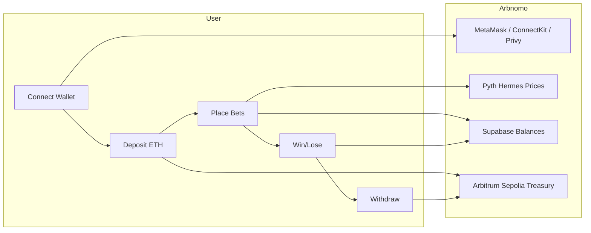
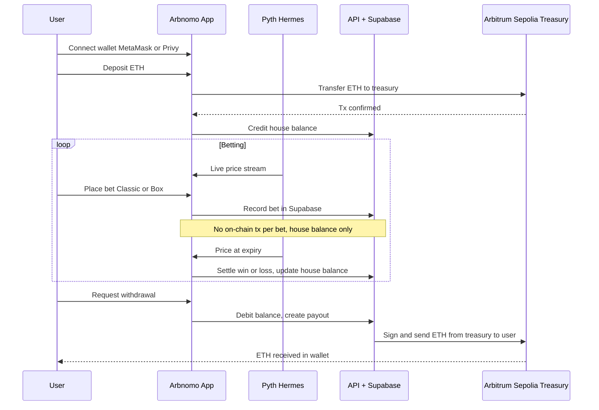

# Arbnomo

**The first on-chain binary options trading dApp on Arbitrum Sepolia.**  
Running on **Arbitrum Sepolia**.

Powered by **Arbitrum Sepolia** + **Pyth Hermes** price attestations + **Supabase** + instant house balance.

*Trade binary options with oracle-bound resolution and minimal trust.*

**Treasury (Arbitrum Sepolia):** [`0x83CC763c3D80906B62e79c0b5D9Ab87C3D4D1646`](https://sepolia.arbiscan.io/address/0x83CC763c3D80906B62e79c0b5D9Ab87C3D4D1646)

---

## Why Arbnomo?

Binary options trading in Web3 is rare. Real-time oracles and sub-second resolution have been the missing piece.

- **Pyth Hermes** delivers millisecond-grade prices for 300+ assets (crypto, stocks, metals, forex).
- **Arbitrum Sepolia** — low fees and fast finality for deposits and withdrawals.
- **House balance** — place unlimited bets without signing a transaction every time; only deposit/withdraw hit the chain.
- **5s, 10s, 15s, 30s, 1m** rounds with oracle-bound settlement.

Arbnomo brings binary options to Arbitrum Sepolia with transparent, on-chain settlement.

---

## Tech Stack

| Layer        | Technology |
|-------------|------------|
| **Frontend** | Next.js 16, React 19, TypeScript, Tailwind CSS, Zustand, Recharts |
| **Blockchain** | **Arbitrum Sepolia**, ethers.js, viem, Wagmi, ConnectKit, Privy |
| **Oracle** | Pyth Network Hermes (real-time prices) |
| **Backend** | Next.js API Routes, Supabase (PostgreSQL) |
| **Payments** | ETH native transfers on Arbitrum Sepolia, single treasury |

---

## Market Opportunity

| Metric | Value |
|--------|--------|
| **Binary options / prediction (TAM)** | $27.56B (2025) → ~$116B by 2034 (19.8% CAGR) |
| **Crypto prediction markets** | $45B+ annual volume (Polymarket, Kalshi, on-chain) |
| **Crypto derivatives volume** | $86T+ annually (2025) |
| **Crypto users** | 590M+ worldwide |

---

## Competitive Landscape

| Segment | Examples | Limitation vs Arbnomo |
|--------|----------|----------------------|
| **Web2 binary options** | IQ Option, Quotex | Opaque pricing, regulatory issues, no on-chain settlement; users do not custody funds. |
| **Crypto prediction markets** | Polymarket, Kalshi, Azuro | Event/outcome markets (e.g. "Will X happen?"), not sub-minute **price** binary options; resolution in hours or days. |
| **Crypto derivatives (CEX)** | Binance Futures, Bybit, OKX | Leveraged perps and positions; not short-duration binary options (5s–1m) with oracle-bound resolution. |
| **On-chain options / DeFi** | Dopex, Lyra, Premia | Standard options (calls/puts), complex UX; no simple "price up/down in 30s" binary product. |
| **Arbitrum Sepolia binary options** | — | No established on-chain binary options dApp; Arbnomo fills this gap. |

**Arbnomo's differentiation:** On-chain binary options on Arbitrum Sepolia with sub-second oracle resolution (Pyth Hermes), house balance for instant bets, and dual modes (Classic + Box) in one treasury.

---

## Future

Endless possibilities across:

- **Stocks, Forex** — Expand beyond crypto into traditional markets via oracles.
- **Options** — Standard options (calls/puts) on top of the same infrastructure.
- **Derivatives & Futures** — More products for advanced traders.
- **DEX** — Deeper DeFi integration and on-chain liquidity.

**Ultimate objective:** To become the go-to on-chain venue for short-duration, oracle-settled binary options on Arbitrum and beyond.

---

## How It Works



### Flow

1. **Connect** — Connect via MetaMask (ConnectKit/Wagmi) or Privy (social login). All operations use **ETH** on Arbitrum Sepolia.
2. **Deposit** — Send ETH from your wallet to the Arbnomo treasury. Your house balance is credited instantly.
3. **Place bet** — Choose **Classic** (up/down + expiry) or **Box** (tap tiles with multipliers). No on-chain tx per bet.
4. **Resolution** — Pyth Hermes provides the price at expiry; win/loss is applied to your house balance.
5. **Withdraw** — Request withdrawal; ETH is sent from the treasury to your wallet on Arbitrum Sepolia.

---

## System Architecture


### Data Flow



### Game Modes


---

## Getting Started

### Prerequisites

- Node.js 18+
- Yarn (or npm)
- An Arbitrum Sepolia wallet (e.g. MetaMask) and some ETH on Arbitrum Sepolia (e.g. from a faucet)
- Supabase project

### 1. Clone and install

```bash
git clone https://github.com/AmaanSayyad/Arbnomo.git
cd Arbnomo
yarn install
```

### 2. Environment variables

```bash
cp .env.example .env
```

Edit `.env` with:

| Variable | Description |
|----------|-------------|
| `NEXT_PUBLIC_WALLETCONNECT_PROJECT_ID` | WalletConnect project ID ([cloud.walletconnect.com](https://cloud.walletconnect.com)) |
| `NEXT_PUBLIC_PRIVY_APP_ID` | Privy app ID (optional, for social login) |
| `PRIVY_APP_SECRET` | Privy app secret (backend only; keep secret) |
| `NEXT_PUBLIC_APP_NAME` | App name shown in the UI (default: `Arbnomo`) |
| `NEXT_PUBLIC_ROUND_DURATION` | Default round duration in seconds (e.g. `30`) |
| `NEXT_PUBLIC_PRICE_UPDATE_INTERVAL` | Price refresh interval in ms (e.g. `1000`) |
| `NEXT_PUBLIC_CHART_TIME_WINDOW` | Chart time window in ms (e.g. `300000`) |
| `NEXT_PUBLIC_SUPABASE_URL` | Supabase project URL |
| `NEXT_PUBLIC_SUPABASE_ANON_KEY` | Supabase anon key |
| `NEXT_PUBLIC_ARB_NETWORK` | `arbitrumSepolia` |
| `NEXT_PUBLIC_ARB_RPC_ENDPOINT` | Arbitrum Sepolia RPC URL |
| `NEXT_PUBLIC_ARB_TREASURY_ADDRESS` | Treasury address for deposits/withdrawals |
| `ARB_TREASURY_SECRET_KEY` | Treasury private key (withdrawals; backend only; keep secret) |

### 3. Supabase

1. Create a project at [supabase.com](https://supabase.com).
2. Run the SQL migrations in `supabase/migrations/` in the Supabase SQL Editor.

### 4. Run the app

```bash
yarn dev
```

Open [http://localhost:3000](http://localhost:3000); the app redirects to `/trade`.

---

## Arbitrum Sepolia

Arbnomo is built for **Arbitrum Sepolia**:

- **ETH only** — Deposits and withdrawals are native ETH transfers. House balance is tracked in ETH.
- **Treasury** — An EOA on Arbitrum Sepolia; no custom contract required for core flow.
- **Wallets** — Connect via ConnectKit (MetaMask, Rabby, etc.) or Privy.
